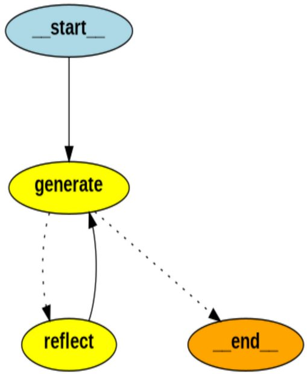

# Linkedin Reflection Agent
This project implements an **AI Reflection Agent** using [LangGraph](https://github.com/langchain-ai/langgraph), specifically designed to **generate and refine LinkedIn posts**.

The agent simulates the workflow of a professional LinkedIn content strategist:  
1. Generate a draft LinkedIn post based on a user prompt.  
2. Critically evaluate the post’s structure, tone, clarity, readability, engagement potential, relevance, and use of formatting/hashtags/media.  
3. Provide actionable feedback to iteratively improve the post.  

The system produces **concise, professional, and engaging LinkedIn posts**, optimized for both readability and audience engagement.

---

## Features
- Graph-based workflow powered by **LangGraph**  
- Self-evaluation & feedback loop  
- Generates and refines LinkedIn posts  
- Demonstrates **reflection in AI** step by step  

---

## Repository Structure
```
linkedin-reflection-agent/
│
├── examples/
│   └── workflow.jpg       # graph-based workflow
├── Reflection_Agent.ipynb # Main notebook with full workflow
├── requirements.txt # Dependencies
└── README.md
```

---

## Installation
Clone the repository and install dependencies:

```bash
git clone https://github.com/your-username/reflection-agent-langgraph.git
cd linkedin-reflection-agent
pip install -r requirements.txt
```

## Usage

Run the Jupyter notebook
```
jupyter notebook Reflection_Agent.ipynb
```
Follow the steps inside to:

- Generate a draft LinkedIn post

- Let the Reflection Agent evaluate and critique it

- See the improved, polished version

## Reflection Critique (agent reasoning step):

- Strengths: Clear announcement, professional tone, relevant hashtags.

- Weaknesses: Slightly generic phrasing, could be more engaging.

- Actionable Suggestions: Add enthusiasm (emoji), break long sentences for readability, include a subtle call-to-action to encourage engagement

## Workflow
The agent follows a graph-based workflow that enables iterative self-improvement:

<p align="center">
  
</p>


